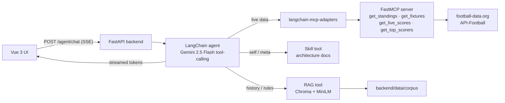

# GoldenGoal — World Cup 2026 AI Agent

GoldenGoal is an AI **soccer coach** for the FIFA World Cup 2026. Ask it anything
about the tournament and a **LangChain agent** (Google Gemini, tool-calling)
decides how to answer:

- **Historical / reference facts** (formats, rules, hosts, stadiums, past
  winners, team history) → answered from a **RAG** knowledge base built from
  curated Wikipedia pages.
- **Live / current data** (today's fixtures, group standings, live scores, top
  scorers) → answered from **MCP football tools** that call live football APIs.
- **"How are you built?"** meta questions → answered from a curated **skill**
  (verbatim architecture docs about this app).

The whole thing runs on **free tiers**: the backend is a FastAPI app deployed as
a Hugging Face Docker Space; the Vue frontend is a static SPA. Answers stream
token-by-token over Server-Sent Events.

## Tech stack

| Layer | Choice | Notes |
|---|---|---|
| **Frontend** | Vue 3 + Vite + TypeScript | Chat UI + Standings/Schedule views; SSE streaming |
| **Backend** | FastAPI (Python 3.12, `uv`) | `/agent/chat`, `/ask`, `/health`, … on port 7860 |
| **Agent** | LangChain 1.x `create_agent` | Compiled LangGraph; Gemini tool-calling loop |
| **LLM** | Google Gemini `gemini-2.5-flash` | Free tier; `temperature=0` |
| **RAG embeddings** | `all-MiniLM-L6-v2` (local) | 384-dim, runs in-process, no API cost |
| **Vector store** | Chroma (persistent, local) | Rebuilt from the committed corpus on boot |
| **MCP server** | FastMCP (stdio subprocess) | Football tools, loaded via `langchain-mcp-adapters` |
| **Live data** | football-data.org + API-Football | Falls back to bundled sample data without keys |
| **Deploy** | HF Docker Space (backend) + static host (frontend) | Backend image built from the repo `Dockerfile` |

## Architecture



The agent's LLM picks the right tool(s) per question and may call **several**
(e.g. compare a team's current form to a past campaign → live tool **and** RAG),
then writes a grounded answer.

## Components

### Agent — `backend/app/agent.py`
The orchestrator. Built with LangChain's `create_agent`, it runs a tool-calling
loop: the LLM reads the question, decides which tool(s) to call, reads their
output, and writes a grounded answer. It is assembled with three kinds of tools
(RAG, skill, MCP football) and a `COACH_SYSTEM_PROMPT` that sets the persona,
tool-routing rules, and guardrails — including a rule to **never store or echo
personal details** (emails, phone numbers, etc.). An in-memory checkpointer keeps
short-term conversation state per `thread_id`.

### RAG — `backend/rag/`
The knowledge base for historical/reference facts. A curated corpus
(`backend/data/corpus/*.txt`, ~14 Wikipedia pages) is chunked
(`RecursiveCharacterTextSplitter`, 500/50), embedded locally with MiniLM, and
stored in Chroma (~1,565 chunks). At query time the agent's `search_worldcup_knowledge`
tool retrieves the top matches and the LLM answers **only** from them.

### MCP — `backend/mcp_server/football_tools.py`
A standalone **FastMCP** server exposing live football tools: `get_standings`,
`get_fixtures`, `get_live_scores`, `get_top_scorers`, `get_todays_matches`,
`get_results`. The agent launches it as a stdio subprocess via
`langchain-mcp-adapters`, so the MCP tools appear to the agent as ordinary
LangChain tools. It calls football-data.org and API-Football, and degrades to
bundled sample data when no API keys are set.

### Skill — `backend/skills/goldengoal-architecture/`
Curated, verbatim docs about how **this app** is built. Surfaced via a
`read_skill_file` tool: for "how are you built?" questions the agent reads
`SKILL.md` to see the index, then reads the matching `reference/*.md` file and
answers from it — no hard-coded routing.

### Services — `backend/services/football.py`
Returns **structured JSON** (not LLM text) for the frontend's Standings and
Schedule views, behind the `/standings` and `/schedule` endpoints.

## FastAPI endpoints (`backend/app/main.py`)

| Method | Path | Purpose |
|---|---|---|
| `POST` | `/agent/chat` | Streamed agent answer (SSE: token / tool / done / error). Used by the chat UI |
| `POST` | `/ask` | Non-streaming RAG answer (grounded answer + retrieved sources) |
| `POST` | `/ingest` | Add a single `.txt` file to the corpus index |
| `POST` | `/ingest/corpus` | Rebuild the index from every `.txt` in `data/corpus` |
| `GET` | `/standings` | Structured group standings for the FE view |
| `GET` | `/schedule` | Structured fixtures/schedule for the FE view |
| `GET` | `/health` | Service status + indexed chunk count |
| `GET` | `/debug/chunks` | Inspect stored chunks/embeddings |
| `DELETE` | `/reset` | Clear the vector store |

On startup the backend rebuilds the Chroma index from the committed corpus if it
is empty, so deploys are deterministic.

## Run the backend

Dependencies are managed with [uv](https://docs.astral.sh/uv/).

```bash
cd backend
uv sync                              # create .venv from the lockfile

# (one-off) fetch the Wikipedia corpus, then build the index
uv run python -m scripts.build_corpus
uv run python -m rag.ingest

# serve the API
uv run uvicorn app.main:app --reload --port 8000
```

Secrets live in a repo-root `.env` (copy `.env.example`):

- `GOOGLE_API_KEY` — **required** for `/ask` and `/agent/chat` (Gemini).
- `FOOTBALL_DATA_KEY`, `API_FOOTBALL_KEY` — **optional**; without them the live
  football tools return bundled sample data.

## Run the frontend

```bash
cd frontend
npm install
npm run dev      # http://localhost:5173
```

The UI talks to the backend at `VITE_API_BASE` (defaults to
`http://localhost:8000`). Set it to your backend URL for a deployed build:

```bash
VITE_API_BASE="https://<your-backend-host>" npm run build
```

## Monorepo layout

```
worldcup-agent/
  backend/
    app/          # FastAPI surface + agent (main.py, agent.py)
    rag/          # embeddings, Chroma store, ingestion, retrieval
    services/     # structured football data for the FE views
    mcp_server/   # FastMCP football tools (stdio subprocess)
    skills/       # goldengoal-architecture skill (self-knowledge docs)
    scripts/      # build_corpus.py (fetch Wikipedia -> data/corpus)
    data/         # committed corpus + gitignored chroma_db
  frontend/       # Vue 3 + Vite chat UI
  docs/           # supporting docs
  Dockerfile      # backend image for the Hugging Face Space
```

## Deployment

- **Backend:** the repo `Dockerfile` builds the FastAPI app and serves it on port
  `7860` (the Hugging Face Space front-matter at the top of this file configures
  the Space). The Chroma index is rebuilt from the committed corpus on first boot.
- **Frontend:** a static Vite build (`npm run build`) hosted on any static host,
  pointed at the backend via `VITE_API_BASE`.
