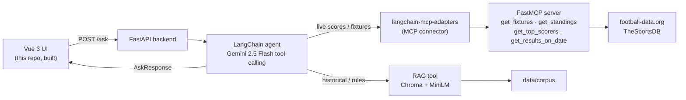

# GoldenGoal — World Cup 2026 AI Agent

An agentic **RAG + MCP + Agent + Vue** demo built around the FIFA World Cup 2026, running on free tiers.


> ### 🚧 Current status: Phase 1 — UI on mock data
> This repository currently ships the **Vue 3 frontend only**, answering questions with
> **mock/dummy data** (see [`frontend/src/api/mock.ts`](frontend/src/api/mock.ts)). It is an
> **interview showcase** of the intended architecture and UX. The backend, RAG pipeline, MCP
> football tools, and the agent orchestration layer are **planned next** — the UI is already
> wired against a stable `AskResponse` contract so the mock can be swapped for the real agent
> without UI changes. See the [Build phases](#build-phases) and [Target architecture](#target-architecture) below.

- **Agent:** LangChain agent driven by Gemini tool-calling — routes each question to RAG and/or live tools
- **LLM:** Google Gemini `gemini-2.5-flash` (free tier)
- **Backend:** FastAPI (`/ask`, `/health`)
- **MCP connector:** `langchain-mcp-adapters` — exposes the MCP tools to the LangChain agent as tools
- **MCP server:** FastMCP football tools (separate process): `get_fixtures`, `get_standings`, `get_top_scorers`, `get_results_on_date`
- **Live data:** football-data.org (primary), TheSportsDB + openfootball (fallbacks)
- **Embeddings:** local `all-MiniLM-L6-v2` (no API cost)
- **Vector store:** Chroma (local)
- **Frontend:** Vue 3 + Vite


## Screenshots

> Phase 1 frontend (Vue 3 + Vite) running on mock data.

| Ask AI (chat) | Standings |
| --- | --- |
|  |  |

**Animated intro splash**


## Monorepo layout

```
worldcup-agent/
  backend/      # FastAPI + RAG + the agent layer        (Phases 2–6)
  mcp_server/   # FastMCP football tools                 (Phase 4)
  frontend/     # Vue 3 + Vite chat UI                   (Phase 1 — built)
  data/         # committed corpus + gitignored chroma_db
  docs/
```

## Build phases

| Phase | Status | What |
| --- | --- | --- |
| 0. Repo setup | ✅ done | Monorepo skeleton + `.gitignore` + `.env.example` |
| 1. Frontend + dummy data | ✅ done | Vue chat UI against a **mock** `/ask` + source badge |
| 2. Backend contract | ⬜ next | FastAPI `/ask` + `/health` returning stubbed responses |
| 3. RAG (reuse existing) | ⬜ | Copy `rag-poc-langchain` RAG → `backend/app/rag/`, Gemini + MiniLM |
| 4. MCP tools | ⬜ | `mcp_server/football_tools.py` (FastMCP) |
| 5. Agent layer | ⬜ | `langchain-mcp-adapters` + RAG-as-a-tool routing |
| 6. Integrate | ⬜ | Replace mock data with the real agent |
| 7. Harden + ship | ⬜ | Rate limit, caching, keep-warm, deploy |

## Target architecture

Where this is heading once the backend, RAG, MCP, and agent layers land:



**How the swap works:** the UI depends only on the `AskResponse` type
([`frontend/src/api/types.ts`](frontend/src/api/types.ts)). Today `askMock()` returns that shape;
in Phase 6 it becomes a real `fetch()` to the FastAPI `/ask` endpoint. Behind `/ask`, a **LangChain
agent** (Gemini tool-calling) routes each question to **RAG** (history, rules, formats), to a
**live MCP tool** reached through the **`langchain-mcp-adapters` connector** into the **FastMCP**
server (today's scores, standings, fixtures), or **both combined** — and the existing source badge
(`RAG` / `LIVE` / `AGENT`) already reflects that routing.

## Run the frontend (Phase 1)

```bash
cd frontend
npm install
npm run dev
```

Then open http://localhost:5173. The chat returns **mock** answers and shows whether each
answer would come from RAG, a live MCP tool, or the combined agent.
