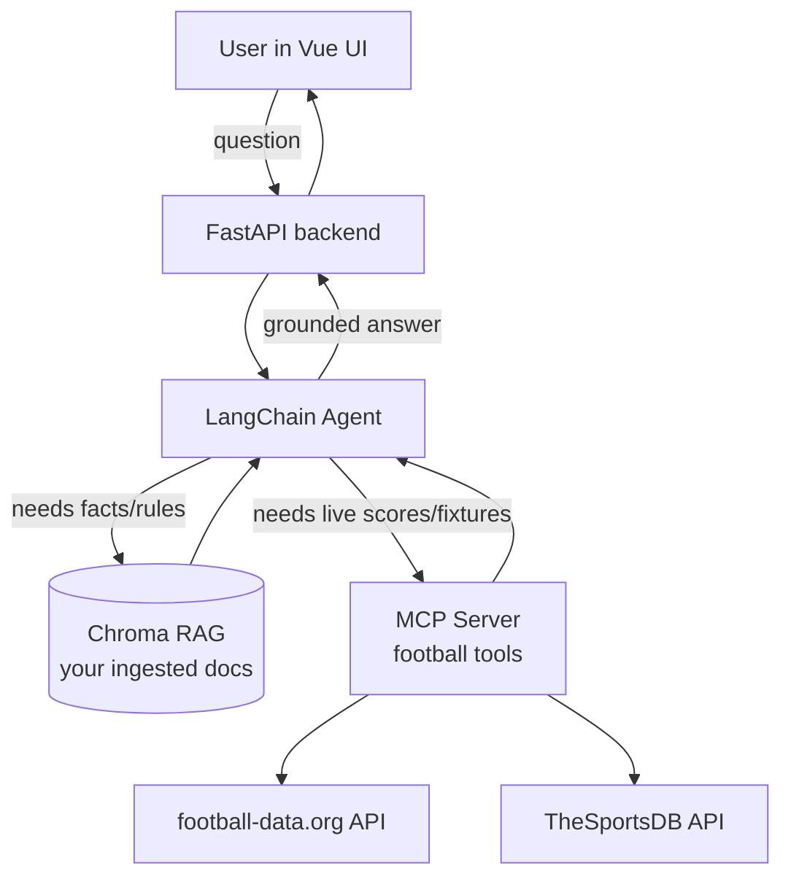
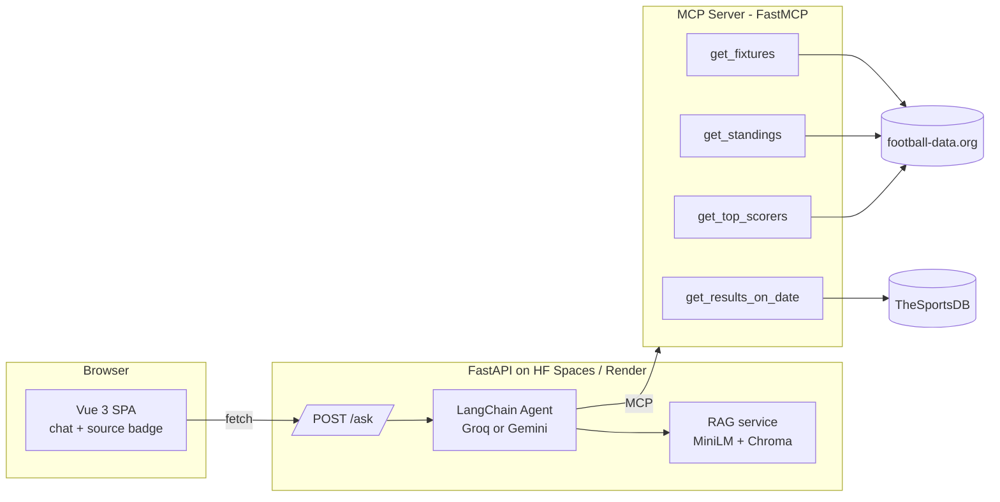

# World Cup 2026 Match‑Day Companion — Build Plan

> An agentic RAG + MCP demo you can share as a single live URL.
> Goal: a portfolio piece that combines **RAG** (your own docs), **MCP** (tool server),
> a **LangChain agent** (decides what to do), and a **Vue** frontend — running at **$0/month**.

**Every API, SDK, and provider below is real and has been verified against its official docs.
No mock data, no placeholder services.** Each one is linked so you can confirm it yourself.

---

## 1. What it does (the demo story)

A user opens a web page and asks things like:

| Question | Where the answer comes from |
| --- | --- |
| "When does the USA play next?" | **Live data** via MCP tool → football‑data.org |
| "What's the current Group F table?" | **Live data** via MCP tool → football‑data.org / TheSportsDB |
| "What were the results yesterday?" | **Live data** via MCP tool → TheSportsDB events‑by‑day |
| "Explain the new 2026 tournament format" | **RAG** over a tournament‑rules document you ingest |
| "Who has scored the most goals so far?" | **Live data** via MCP tool → top scorers endpoint |

The **agent** reads the question, decides whether it needs **live data (call an MCP tool)**
or **background knowledge (RAG retrieval)**, then writes a grounded answer.



---

## 2. Verified building blocks

### 2.1 Live football data (REAL, free)

#### A. football-data.org (v4 REST API)
- **Docs:** https://www.football-data.org/documentation/quickstart
- **Auth:** header `X-Auth-Token: <YOUR_FREE_KEY>` (free key by email signup)
- **Free tier:** ~10 requests/minute, includes the **World Cup** competition (code `WC`)
- **Key endpoints:**
  - Fixtures: `GET https://api.football-data.org/v4/competitions/WC/matches`
    - filters: `status` (`SCHEDULED|LIVE|IN_PLAY|PAUSED|FINISHED`), `dateFrom`, `dateTo`,
      `stage` (`GROUP_STAGE|LAST_16|QUARTER_FINALS|SEMI_FINALS|FINAL`), `matchday`
  - Standings: `GET /v4/competitions/WC/standings`
  - Top scorers: `GET /v4/competitions/WC/scorers`
  - Teams: `GET /v4/competitions/WC/teams`
  - Head‑to‑head: `GET /v4/matches/{matchId}/head2head`

> ⚠️ Confirm `WC` is enabled on your specific free key when you sign up — the free competition
> list is shown in your account dashboard. If World Cup is gated, fall back to TheSportsDB below.

#### B. TheSportsDB (v1 REST API)
- **Docs:** https://www.thesportsdb.com/free_sports_api
- **Auth:** free public key is **`123`** → base URL `https://www.thesportsdb.com/api/v1/json/123/`
- **Free tier:** 30 requests/minute (live in‑play scores are premium‑only / v2)
- **Key endpoints:**
  - Next fixtures for a league: `eventsnextleague.php?id={leagueId}`
  - Past results for a league: `eventspastleague.php?id={leagueId}`
  - Events on a date: `eventsday.php?d=2026-06-26&s=Soccer`
  - League table: `lookuptable.php?l={leagueId}&s={season}`
  - Find the league id: `all_leagues.php` or `search_all_leagues.php?c=World&s=Soccer`

> 🔎 Look up the FIFA World Cup `leagueId` at runtime via `all_leagues.php` — **don't hardcode a
> guessed id.** TheSportsDB does carry FIFA World Cup data (events are named like
> `fifa_world_cup_2022-12-18_argentina_vs_france`).

#### C. Bonus: TheSportsDB ships an *official* MCP server
- They publish an MCP spec directly: `https://www.thesportsdb.com/api/spec/v1/MCP/index.js`
  (and a v2 variant). This is a real, ready‑made MCP integration point you can mention/use
  alongside your own MCP server.

#### D. Fallback / no‑auth data sources (REAL, free)
Useful as backups when a free quota is exhausted or a key is gated:

| Source | URL | Auth | Use for |
| --- | --- | --- | --- |
| **API‑Football** (api‑sports.io) | https://www.api-football.com | free key, ~100 req/day | Richer per‑match data / backup live source |
| **openfootball/worldcup.json** | https://github.com/openfootball/worldcup.json | none (public‑domain JSON) | Historical results + scheduled fixtures, zero rate limit |

> Verify current free‑tier limits at signup — these numbers drift. Design so the live‑data layer
> can switch sources behind one interface (e.g. `football-data.org` primary → API‑Football →
> openfootball JSON for history).

### 2.2 MCP — the tool server (REAL, free, open source)
- **Official Python SDK:** `mcp` (FastMCP) — https://github.com/modelcontextprotocol/python-sdk
  - install: `uv add "mcp[cli]"`
  - define a tool with the `@mcp.tool()` decorator; run over stdio or streamable‑HTTP
- **LangChain bridge:** `langchain-mcp-adapters` — https://github.com/langchain-ai/langchain-mcp-adapters
  - `MultiServerMCPClient(...).get_tools()` turns MCP tools into LangChain tools usable by an agent
- **Existing soccer MCP servers you can fork** (faster start + a strong interview talking point —
  *"I forked an open‑source MCP server and adapted it for the World Cup"*). Search GitHub and
  **verify the repo still exists / is maintained before relying on it**, then trim it to the tools
  you need (`get_live_matches`, `get_standings`, `get_match_details`):
  - Python options (closest to this stack): e.g. `obinopaul/soccer-mcp-server`, `yeonupark/mcp-soccer-data`
  - TypeScript options: e.g. `MarvDann/api-football-mcp`, `yalmeidarj/mcp-football-server`
  - Either way, repoint its backing client at your cached data layer so caching is shared.

### 2.3 Free LLM provider (pick ONE — both REAL, both free)
- **Groq** (fast, generous free tier): `langchain-groq`, class `ChatGroq`
  - key: https://console.groq.com → env `GROQ_API_KEY`
  - https://python.langchain.com/docs/integrations/chat/groq/
- **Google Gemini** (free tier, multimodal): `langchain-google-genai`, class `ChatGoogleGenerativeAI`
  - key: https://ai.google.dev/gemini-api/docs/api-key → env `GOOGLE_API_KEY`
  - model e.g. `gemini-2.5-flash`
  - https://python.langchain.com/docs/integrations/chat/google_generative_ai/

> **Chosen: Google Gemini `gemini-2.5-flash`** — most reliable infra + strongest native tool‑calling,
> which is exactly what the agent needs to route between RAG and the MCP tools. Groq stays as a
> one‑line swap if you later want its faster token speed. **Check current model names / free‑tier
> limits in the provider console** — they change.

### 2.4 Free embeddings (REAL, free, runs locally — no API cost)
- `langchain-huggingface` + `sentence-transformers`, model **`all-MiniLM-L6-v2`** (384 dims)
- Replaces OpenAI embeddings from the current POC; no key, no per‑call cost.

### 2.5 Vector store (REAL, free)
- **Chroma** (already used in your existing POC) — local, persistent, zero cost.

### 2.6 Frontend (REAL, free)
- **Vue 3 + Vite** single‑page app: a chat box + a "data source" badge showing whether each
  answer came from RAG or a live tool.

### 2.7 Hosting (REAL, free tiers)
- **Backend (FastAPI + agent + MCP):** Hugging Face Spaces (Docker) **or** Render free web service.
- **Frontend (Vue):** Vercel **or** Netlify free tier → gives you the shareable URL.
- **Data + secrets:** API keys via the host's environment‑variable settings (never in git).
- **Keep‑warm:** free hosts spin down when idle (Render ~15 min) and cold‑start in ~30–60 s.
  Mitigate with a free uptime pinger (e.g. UptimeRobot) hitting `/health` every ~5 min.
- **Ephemeral filesystem:** on Render/Spaces the local Chroma files can vanish on redeploy.
  Mitigate by **rebuilding the index on startup from a git‑committed corpus** (cheap with local
  MiniLM), or back up the Chroma SQLite file to a free object store.

**Monthly cost: $0** — every component above has a usable free tier.

### 2.8 RAG corpus — what to actually ingest (REAL, free)
Give the agent real static knowledge to retrieve over (history, rules, team/stadium profiles):

| Source | Method | Content |
| --- | --- | --- |
| **Wikipedia REST API** | `GET https://en.wikipedia.org/api/rest_v1/page/summary/{title}` | Team pages, past World Cups, stadium pages |
| **openfootball repo** | raw GitHub JSON/text | Historical results 1930–present |
| **FIFA.com** | HTML scrape (respect robots.txt, cache hard) | Official tournament/group info |

Suggested build‑once corpus: ~48 team pages + past tournament pages (1930–2022) + host‑stadium
pages + the format/rules page. Roughly 5–10 MB raw → a few thousand 500‑char chunks → fits easily
in local Chroma. Commit the scraped `.txt` corpus to git so the index can be rebuilt on any deploy.

---

## 3. Target architecture



---

## 4. MCP tool design (sketch)

```python
# mcp_server/football_tools.py
import os, httpx
from mcp.server.fastmcp import FastMCP

mcp = FastMCP("football-tools", stateless_http=True, json_response=True)
FBD_KEY = os.environ["FOOTBALL_DATA_KEY"]
FBD = "https://api.football-data.org/v4"

@mcp.tool()
async def get_fixtures(competition: str = "WC", status: str | None = None) -> list[dict]:
    """Upcoming or live World Cup fixtures. status: SCHEDULED|LIVE|IN_PLAY|FINISHED."""
    params = {"status": status} if status else {}
    async with httpx.AsyncClient() as c:
        r = await c.get(f"{FBD}/competitions/{competition}/matches",
                        headers={"X-Auth-Token": FBD_KEY}, params=params, timeout=10)
        r.raise_for_status()
    return [
        {"home": m["homeTeam"]["name"], "away": m["awayTeam"]["name"],
         "utcDate": m["utcDate"], "status": m["status"],
         "score": m["score"]["fullTime"]}
        for m in r.json()["matches"]
    ]

@mcp.tool()
async def get_standings(competition: str = "WC") -> list[dict]:
    """Current group/league standings for the competition."""
    async with httpx.AsyncClient() as c:
        r = await c.get(f"{FBD}/competitions/{competition}/standings",
                        headers={"X-Auth-Token": FBD_KEY}, timeout=10)
        r.raise_for_status()
    return r.json()["standings"]

@mcp.tool()
async def get_top_scorers(competition: str = "WC") -> list[dict]:
    """Top scorers for the competition."""
    async with httpx.AsyncClient() as c:
        r = await c.get(f"{FBD}/competitions/{competition}/scorers",
                        headers={"X-Auth-Token": FBD_KEY}, timeout=10)
        r.raise_for_status()
    return [{"player": s["player"]["name"], "team": s["team"]["name"],
             "goals": s["goals"]} for s in r.json()["scorers"]]

if __name__ == "__main__":
    mcp.run(transport="streamable-http")
```

```python
# A second tool backed by TheSportsDB (free key "123") for results-by-day
TSDB = "https://www.thesportsdb.com/api/v1/json/123"

@mcp.tool()
async def get_results_on_date(date: str) -> list[dict]:
    """Soccer results for a date, format YYYY-MM-DD."""
    async with httpx.AsyncClient() as c:
        r = await c.get(f"{TSDB}/eventsday.php", params={"d": date, "s": "Soccer"}, timeout=10)
        r.raise_for_status()
    events = r.json().get("events") or []
    return [{"event": e["strEvent"], "home": e["strHomeTeam"], "away": e["strAwayTeam"],
             "home_score": e["intHomeScore"], "away_score": e["intAwayScore"]} for e in events]
```

### Wiring the tools into the agent

```python
# backend/agent.py
from langchain_mcp_adapters.client import MultiServerMCPClient
from langchain.agents import create_agent           # or langgraph prebuilt
from langchain_google_genai import ChatGoogleGenerativeAI

client = MultiServerMCPClient({
    "football": {"transport": "streamable_http", "url": "http://localhost:8001/mcp"},
})
tools = await client.get_tools()                     # MCP tools -> LangChain tools

# RAG retrieval is added as one more tool so the agent can *choose* it
tools.append(rag_retrieval_tool)                     # wraps Chroma similarity search

agent = create_agent(ChatGoogleGenerativeAI(model="gemini-2.5-flash"), tools)
answer = await agent.ainvoke({"messages": "When does the USA play next?"})
```

---

## 5. Phased implementation (frontend‑first)

Build the **UI with dummy data first** so the experience and the API contract are locked before any
real model/data work. Each later phase swaps one chunk of dummy data for the real thing without
changing the frontend.

| Phase | Goal | Key work | Done when |
| --- | --- | --- | --- |
| **0. Repo setup** | New monorepo | Create `worldcup-agent` repo + folders (`backend/`, `mcp_server/`, `frontend/`, `data/`, `docs/`); `.gitignore`, `.env.example` placeholders | Repo pushed, structure in place |
| **1. Frontend + dummy data** | Nail the UX first | Vue 3 + Vite chat UI with a **mock `/ask`** returning canned answers + a "data source" badge (RAG / live); deploy to Vercel early | Shareable URL shows a working chat against fake data |
| **2. Backend contract** | Real API, fake brains | FastAPI `/ask` + `/health` returning **stubbed** responses in the final JSON/SSE shape; point the Vue app at it | Frontend talks to real backend, answers still mocked |
| **3. RAG (reuse existing)** | Real static knowledge | Copy the existing `rag-poc-langchain` code into `backend/app/rag/`; swap to free LLM (`ChatGroq`/Gemini) + local **MiniLM** embeddings + Chroma; ingest the corpus (§2.8) | `/ask` answers real RAG questions; badge shows "RAG" |
| **4. MCP tools** | Real live data | Build `mcp_server/football_tools.py` (FastMCP) with caching against football‑data.org / TheSportsDB | Tools return real fixtures/standings/scorers |
| **5. Agent layer** | Let the model choose | Add `langchain-mcp-adapters` + RAG‑as‑a‑tool; build the agent loop so it routes RAG vs live per question | Agent answers both pure‑RAG and pure‑live questions correctly |
| **6. Integrate** | Kill the dummy data | Replace every mock with the real agent; add source badges + optional SSE streaming / live widgets | End‑to‑end real answers in the deployed UI |
| **7. Harden + ship** | Safe to share | Rate limiting (`slowapi`), response caching, keep‑warm ping, prompt‑injection hardening, final deploy | No quota blowups, no leaked keys, public URL stable |

---

## 6. Repo / project layout (monorepo — decided)

Single repo **`worldcup-agent`** (the agent layer lives *inside* `backend/`, not as its own folder):

```
worldcup-agent/
  backend/
    app/
      main.py            # FastAPI: /ask (SSE), /matches/today, /standings, /health
      agent.py           # “agent layer”: LLM + tool wiring + loop
      rag/
        ingest.py        # corpus scraper + chunker
        embeddings.py    # local MiniLM (sentence-transformers)
        store.py         # Chroma persistent client
        retriever.py     # RAG-as-a-tool for the agent
      tools/
        football_data.py # cached football-data.org / TheSportsDB client
        mcp_client.py    # connects agent to the MCP server
    scripts/
      scrape_corpus.py   # run once to build data/corpus/
      build_index.py     # embed corpus -> chroma_db
  mcp_server/
    football_tools.py    # FastMCP server (get_fixtures, get_standings, ...)
  frontend/              # Vue 3 + Vite SPA (chat + source badge + live widgets)
  data/
    corpus/              # committed .txt corpus (so the index can be rebuilt on deploy)
    chroma_db/           # generated, gitignored
  docs/
  .env.example           # FOOTBALL_DATA_KEY=, GROQ_API_KEY=  (placeholders only!)
  README.md
```

> **Decided:** one **new** monorepo `worldcup-agent`. The existing `rag-poc-langchain` stays as the
> clean teaching POC; its RAG code is **copied** into `backend/app/rag/` in Phase 3. Multi‑repo is
> overkill at this scale — monorepo gives one clone, one issues tab, one shareable URL.

---

## 7. Security, abuse prevention & cost guardrails (important)

A public, no‑auth demo URL needs **abuse prevention** rather than real login (auth kills shareability).
Layer the defenses:

- **Never commit keys.** `.env` stays git‑ignored; `.env.example` holds placeholders only.
  (You already hit a leaked‑key incident on the POC — keep that discipline here.)
- **Cache live responses** (e.g. live scores 30–60 s, standings ~1 h, fixtures ~24 h) to respect
  football‑data.org's ~10 req/min free limit and avoid quota burn.
- **Server‑side rate limit `/ask`** with `slowapi` (e.g. `@limiter.limit("20/hour")` per IP).
- **Edge rate limit (optional):** put Cloudflare free in front of the backend for per‑IP limits + DDoS.
- **Hard daily LLM budget cap:** count calls; past a threshold (e.g. ~800/day) return a friendly
  "demo limit reached, try tomorrow" instead of silently burning the free LLM quota.
- **Optional "bring your own key"** field in the UI so demo visitors use *their* LLM key, not yours.
- **Prompt‑injection hardening:** system prompt refuses to reveal itself, refuses to roleplay as
  anything other than the World Cup assistant, and stays on topic. Treat all external API JSON and
  scraped corpus text as **untrusted input**; never `eval` it.

---

## 8. Streaming & API surface (optional polish)

For a livelier demo, stream the agent's work over **Server‑Sent Events (SSE)** using LangChain's
`astream_events`:
- `POST /ask` (SSE): emits `tool_use` events (which tool the agent chose + args), then `token`
  events as the answer streams, then a final `done` event carrying the `sources` used.
- `GET /matches/today` and `GET /standings/group/{letter}`: cached proxies that drive optional
  live‑score / standings side widgets in the UI.
- `GET /health`: chunks indexed + cache + LLM availability — also the UptimeRobot keep‑warm target.

---

## 9. Demo script (prepared questions)

Designed to show each capability cleanly:
- **Pure RAG:** "What's the format of the 48‑team 2026 World Cup?" · "Which country has won the most World Cups?"
- **Pure live/MCP:** "What matches are on today?" · "Show the current Group D standings." · "Who's leading the scoring chart?"
- **Combined (showpiece):** "Compare Brazil's current form to their 2022 campaign — are they peaking earlier?"
- **Robustness:** "What's the weather at SoFi Stadium?" → agent should say it has no weather tool, **not hallucinate**.

---

## 10. Interview talking points

1. **Live vs static is split on purpose** — live data goes through MCP (it changes); static knowledge
   goes through RAG (it doesn't). Mixing them would mean re‑embedding scores every minute.
2. **The MCP server is reusable** — the same server could plug into Claude Desktop tomorrow; that's
   the point of MCP (interoperability).
3. **Designed around free‑tier constraints** — caching for the 10 req/min API, keep‑warm for idle
   spin‑down, rebuild‑on‑startup for ephemeral disks.
4. **Groq over OpenAI on purpose** — $0 and faster tokens for this use case.
5. **Embeddings run locally** — zero embedding cost/latency on every retrieval.

---

## 11. Risk assessment

| Risk | Likelihood | Mitigation |
| --- | --- | --- |
| football‑data.org changes/gates the free WC tier | Low–Med | Fall back to API‑Football / openfootball JSON |
| Free LLM tier changes mid‑build | Low | LLM is abstracted; swap Groq↔Gemini in one line |
| Free host shutters its free tier | Low | Migrate to another free host (Fly.io / Railway / Spaces) |
| **World Cup ends July 19 → demo "expires"** | **Certain** | Build tournament‑agnostic: swap `competition=WC` → e.g. `PL` (Premier League, Aug) — same code, different competition id |
| Cold start hurts first impression | Med | UptimeRobot heartbeat + "warming up" toast on first slow request |
| Public URL abused | Low | Cloudflare + slowapi + daily LLM cap |

> The only **certain** risk is the tournament ending — making the competition id a single constant
> turns this into a permanent, reusable demo and is itself a good talking point.

---

## 12. Free accounts to create (no credit card)

Groq (console.groq.com) · football‑data.org (register for a key) · GitHub · a frontend host
(Vercel/Netlify) · a backend host (Render/Hugging Face Spaces) · UptimeRobot · Cloudflare (optional).

---

## 13. Open decisions for you

1. **Hosting pair:** Vercel + Hugging Face Spaces, or Netlify + Render? *(can decide at Phase 7)*

*Resolved:* **LLM = Google Gemini `gemini-2.5-flash`** · **data = football‑data.org** (primary) with
TheSportsDB + openfootball JSON as fallbacks · repo = one **new monorepo `worldcup-agent`** · build
order = **frontend‑first with dummy data** (see §5).

---

### Source references (all verified)
- football-data.org docs — https://www.football-data.org/documentation/quickstart
- TheSportsDB free API — https://www.thesportsdb.com/free_sports_api
- MCP Python SDK — https://github.com/modelcontextprotocol/python-sdk
- LangChain MCP adapters — https://github.com/langchain-ai/langchain-mcp-adapters
- ChatGroq (LangChain) — https://python.langchain.com/docs/integrations/chat/groq/
- ChatGoogleGenerativeAI (LangChain) — https://python.langchain.com/docs/integrations/chat/google_generative_ai/
